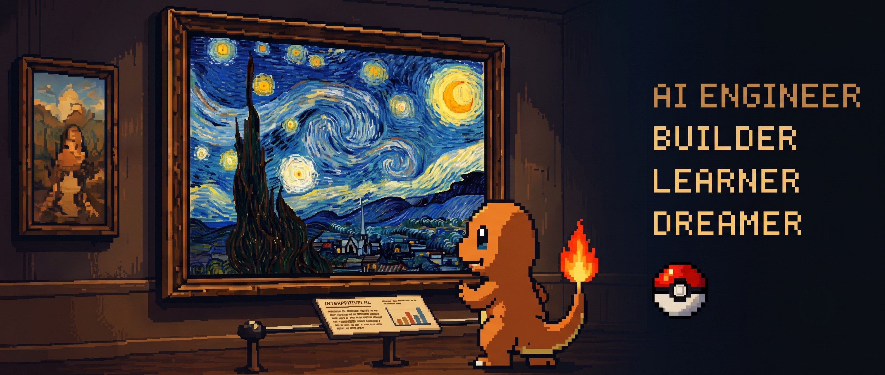
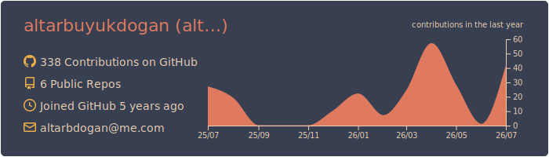
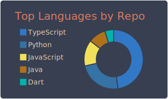
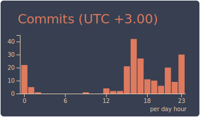
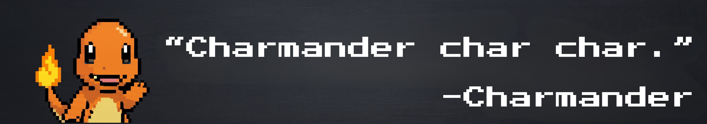

<p align="center">
  
</p>

<h1 align="center">Hi, I'm Altar 👋</h1>

<p align="center">
AI / Machine Learning Engineer • Building useful AI-powered products
</p>

<p align="center">
  <a href="https://www.linkedin.com/in/altarb/">
    
  </a>

  <a href="https://ialtar.dev">
    
  </a>

  <a href="https://museary.art">
    
  </a>

</p>

---

<table>
<tr>

<td width="55%" valign="top">

## About Me

I'm a Computer Engineering graduate from Turkey with a passion for building products powered by Artificial Intelligence.

My current interests include

- 🧠 Large Language Models
- 💬 Natural Language Processing
- 👁️ Computer Vision & Image Processing
- 📱 Mobile AI
- ⚽ Sports Analytics
- 🎨 Digital Art & Museums
- 🛠️ Open Source

I enjoy combining AI with thoughtful product design to create experiences that are both useful and enjoyable.

</td>

<td width="45%" valign="top">

## `altar@github:~$ whoami`

```yaml
name: Altar Büyükdoğan

role:
  - AI Engineer
  - Machine Learning

currently:
  - Building AI products
  - Exploring LLMs

interests:
  - NLP
  - Computer Vision
  - Image Processing
  - Sports Analytics
  - Art
```

</td>

</tr>
</table>

---

# 🚀 Featured Projects

## 🎨 Museary

<p align="center">

</p>

A digital museum platform designed to make discovering and experiencing art more engaging.

**Highlights**

- Artwork exploration
- Beautiful museum experience
- Modern web application

🌐 **https://museary.art**

🔒 Private Repository

---

<table>
<tr>

<td width="50%" valign="top">

## ⚽ Sports Intelligence Platform

Analytics platform focused on sports data, predictions and explainable AI.

One of its applications explores the FIFA World Cup 2026.

**Tech**

Python

Machine Learning

Next.js

🔒 Private Repository

</td>

<td width="50%" valign="top">

## 📱 Telovia Spam Detector

Hybrid spam detection system using DistilBERT and TensorFlow Lite.

**Tech**

NLP

TensorFlow Lite

DistilBERT

Android

🔒 Private Repository

</td>

</tr>

<tr>

<td width="50%" valign="top">

## 🎮 Feast of Gods

Mobile strategy card game.

Order vs Chaos.

🌐 https://feastofgods.com

🔒 Private Repository

</td>

<td width="50%" valign="top">

## 🐰 BunPop

Casual mobile game.

Built for fun and polished gameplay.

🌐 https://playbunpop.com

🔒 Private Repository

</td>

</tr>

<tr>

<td colspan="2">

## 📖 insanca-tr

Open-source toolkit for simplifying formal Turkish.

TypeScript • npm • Open Source

➡️ https://github.com/altarbuyukdogan/insanca-tr

</td>

</tr>

</table>

---

## 🛠 Tech Stack

<table align="center">
<tr>

<td align="center" width="90">
<br>
Python
</td>

<td align="center" width="90">
<br>
PyTorch
</td>

<td align="center" width="90">
<br>
TensorFlow
</td>

<td align="center" width="90">
<br>
OpenCV
</td>

<td align="center" width="90">
<br>
TypeScript
</td>

<td align="center" width="90">
<br>
React
</td>

<td align="center" width="90">
<br>
Next.js
</td>

<td align="center" width="90">
<br>
Node.js
</td>

<td align="center" width="90">
<br>
Java
</td>

<td align="center" width="90">
<br>
C#
</td>

<td align="center" width="90">
<br>
Unity
</td>

</tr>

<tr>

<td align="center" width="90">
<br>
Firebase
</td>

<td align="center" width="90">
<br>
Supabase
</td>

<td align="center" width="90">
<br>
MySQL
</td>

<td align="center" width="90">
<br>
Docker
</td>

<td align="center" width="90">
<br>
Linux
</td>

<td align="center" width="90">
<br>
Git
</td>

<td align="center" width="90">
<br>
GitHub
</td>

<td align="center" width="90">
<br>
Grafana
</td>

<td align="center" width="90">
<br>
Vercel
</td>

<td align="center" width="90">
<br>
NumPy
</td>

<td align="center" width="90">
<br>
Scikit
</td>

</tr>
</table>

---

## 📊 GitHub

<p align="center">
  
</p>

<p align="center">
  
  
</p>

---

# 🌱 Currently

- Building AI-powered products
- Learning more about LLM systems
- Improving open-source projects
- Exploring multimodal AI

---


